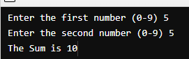
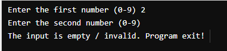

## Project using assembly (NASM) in COMP 2825 - BCIT

### Scope
1. Ask for input of 2 numbers
2. Do the addition operation
3. Display to the terminal  
  

### Addon feature
1. Input validation  
     
2. Display 2 digits number